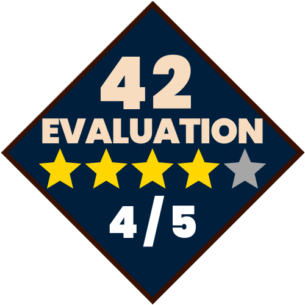

  
  <h2>ECOLE 42/42 ISTANBUL EVALUATION SYSTEM</h2>
    
    
    
    
   
<h4>
    <a href="https://github.com/emre-mr246/42-evaluation/issues">❔ Ask a Question About 42</a>
   / 
    <a href="https://github.com/emre-mr246/42-evaluation/issues">⚠️ Report Anything</a>
</h4>

### **THE NORM 📖**

The norm rules at Ecole 42 are a set of guidelines akin to the **SOLID principles** in software development. These rules enhance the **organization, readability, and maintainability** of projects, fostering disciplined coding practices and **professional-level software craftsmanship**.

Adherence to these norms is crucial; even a single violation can render a project **unacceptable**, potentially resulting in a **failing grade**. This stringent adherence emphasizes the importance of **clean, structured code** that not only meets functional requirements but also follows **best practices in software engineering**.

By adhering to the norm rules, students ensure their projects meet **academic standards** and prepare themselves for **real-world software development**, where clean, maintainable code is essential for **long-term success**.

### **PEER TO PEER EVALUATION 🧑‍🎓**

When completing a project at Ecole 42, it must be approved by three of our peers who evaluate it independently at different times. During this process, they ask questions to ensure the authenticity of our work. Each function used in the project and its underlying workings are scrutinized individually.

Throughout the evaluation, the reviewer monitors our program's execution and checks for memory leaks upon termination. They also assess if our project adheres to the norm rules of Ecole 42.

The evaluation follows specific guidelines outlined on the evaluation page, involving manual testing or automated tools. If our program crashes during evaluation, the project fails, requiring us to retry it later.

At the conclusion of the evaluation, our peers provide feedback in the form of comments. These comments may cover our project's strengths, weaknesses, and recommendations for improvement. Additionally, they assign scores for each evaluated section.

### MOULINETTE "THE GRINDER" 💢

The Moulinette is an automated grading tool used at Ecole 42 to evaluate student projects. This powerful tool ensures that all submissions meet the school's rigorous standards. Here's an overview of its key features and benefits:

- **Automated Testing:** The Moulinette runs a series of predefined tests on your code to check for correctness, efficiency, and adherence to project specifications. It verifies that your program behaves as expected under various conditions.

- **Norm Compliance:** The Moulinette verifies that your code follows Ecole 42 norm rules, akin to modern SOLID principles. These rules promote readability, maintainability, and efficiency. A single norm violation can result in a failing grade, underscoring the importance of clean coding practices.

- **Comprehensive Feedback:** After running tests, the Moulinette provides detailed feedback on your submission. This includes information on detected errors or issues, along with suggestions for improvement. Such feedback is invaluable for learning and enhancing coding skills.

- **Leak Check:**  This capability ensures that student projects manage memory correctly, without unintended leaks that could degrade performance or stability over time. By analyzing memory usage patterns, Moulinette identifies potential leaks and highlights them in its feedback to students.

### **EXAM SYSTEM 🖥️**

Ecole 42 employs a rigorous exam system designed to ensure fairness and uphold high standards of assessment.

1. **Exam Environment:**
   Exams are conducted in designated areas using specialized computers isolated from the internet and with minimal software installed. For example, even basic editor extensions like VSCode, including C extensions, are disabled during exams. This setup ensures a controlled testing environment aimed at maintaining the integrity and security of the process.

2. **Examshell and Question Format:**
   During exams, the system known as examshell presents a randomly generated question tailored to the exam's difficulty level. Students must solve this question within a specified timeframe, demonstrating their real-time understanding and problem-solving skills.

3. **Penalty Period:**
   In the 42 exam repository, uploading incorrect code results in a lockout until the penalty period expires. This underscores the importance of thorough preparation and effective problem-solving strategies from the outset. Moreover, the penalty period increases with each subsequent unsuccessful attempt, emphasizing the need for thoughtful and skillful approach to each try.

4. **Evaluation by grademe:**
   After completing their solutions, students' work is evaluated by grademe, an AI system similar to Moulinette but with stricter assessments. grademe rigorously tests correctness, efficiency, and adherence to project specifications, ensuring consistent and objective grading across all submissions.

5. **Progression and Requirements:**
   Advancing through each level at Ecole 42 requires successfully passing these rigorous exams. This process evaluates not only technical proficiency but also prepares students for professional software development challenges, emphasizing precision and adherence to standards.

### **STAFF CHECK 👮**

Within 42, officials are tasked with monitoring our projects. These individuals randomly review completed projects to assess our understanding. They may open these projects and ask us to explain them thoroughly. 

Based on their evaluation, they generate a performance report. Failing to demonstrate the required competence can lead to severe penalties.

### **GODFATHER/GODCHILD 🎩**

Experienced students have the option to assist specific students. Here, the experienced student is referred to as the 'godfather' and the less experienced one as the 'godchild'. The father can review their child's project before evaluation or assist them during the project development process.
